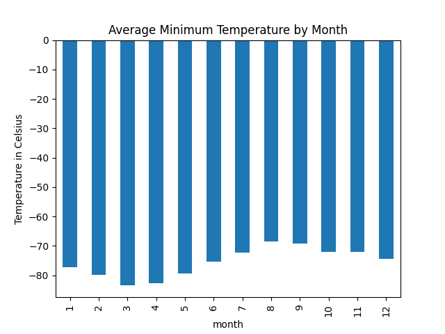
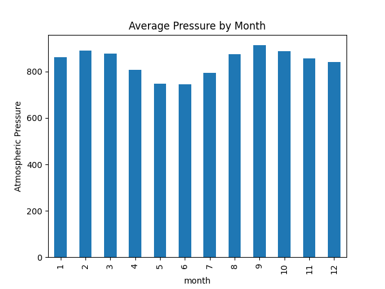
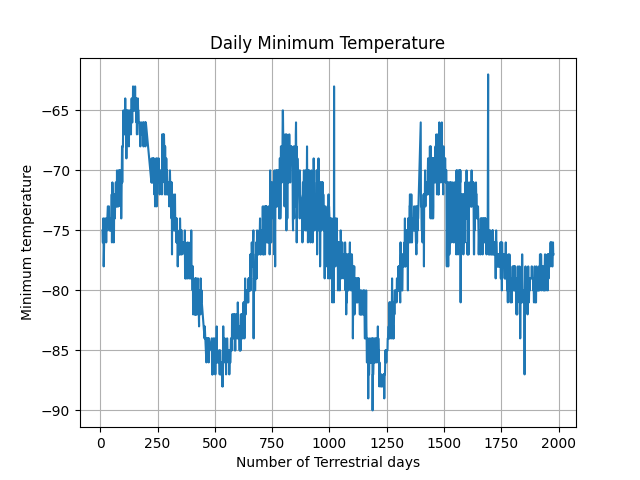

# data-collection-challenge

As part of this assignment, following deliverables to be submitted:
* Deliverable 1: Scrape titles and preview text from Mars news articles.
* Deliverable 2: Scrape and analyze Mars weather data, which exists in a table.
                                                                                                                                                  
Automated browsing was enabled by Splinter and WebDriver Manager. BeautifulSoup objects were created to extract HTML code for both Jupyter Notebooks.                                                
`Mars/part_1_mars_news.ipynb` scrapes Mars news from web and stores the information in a list of Python dictionaries. This data is also stored in `Output/scraped_mars_news_data.json`.             
`Mars/part_2_mars_weather.ipynb` scrapes Mars temperature/weather information from the web and stores the information into a Pandas DataFrame. `Output/mars_weather.csv` is the output csv file for the Pandas DataFrame with Mars temperature/weather information from part 2.

## Part 1: Scrape Titles and Preview Text from Mars News

* Automated browsing (with Splinter) was used to visit the Mars news site, and the HTML code was extracted (with Beautiful Soup).
* The titles and preview text of the news articles were scraped and extracted, and stored in a list of dictionaries.
`[{'title': "NASA's MAVEN Observes Martian Light Show Caused by Major Solar Storm",
  'preview': 'For the first time in its eight years orbiting Mars, NASA’s MAVEN mission witnessed two different types of ultraviolet aurorae simultaneously, the result of solar storms that began on Aug. 27.'}, ...]`
* This scraped data was then stored in a JSON file: `Output/scraped_mars_news_data.json`  

## Part 2: Scrape and Analyze Mars Weather Data

* Splinter and Beautiful Soup were used to scrape the data.

* The HTML table was extracted into a Pandas DataFrame. DataFrame was created with all columns listed on the website.
|  	|id	|terrestrial_date |sol	|ls	  |month	|min_temp  |pressure  |
|---|---|-----------------|-------------------|----------|----------|
|0	|2	|2012-08-16	      |10	  |155	|6	    |-75.0	   |739.0	    |
|1	|13	|2012-08-17	      |11	  |156	|6	    |-76.0	   |740.0	    |
|2	|24	|2012-08-18	      |12	  |156	|6	    |-76.0	   |741.0	    |
|3	|35	|2012-08-19	      |13	  |157	|6	    |-74.0	   |732.0	    |
|4	|46	|2012-08-20	      |14	  |157	|6	    |-74.0	   |740.0	    |

* The dataset was analyzed using Pandas functions:to answer the following questions:

1. How many months exist on Mars? 12
2. How many Martian (and not Earth) days worth of data exist in the scraped dataset? 1867
3. What are the coldest and the warmest months on Mars (at the location of Curiosity)? Plot the average temperature by month.

**The coldest month in Curiosity's location is month 3. The hottest month in Curiosity's location is month 8.**

4. Which months have the lowest and the highest atmospheric pressure on Mars? Plot the results as a bar chart.

**The month with the lowest atmospheric pressure is month 6. The month with the highest atmospheric pressure is month 9.**

5. About how many terrestrial (Earth) days exist in a Martian year? Visually estimate the result by plotting the daily minimum temperature.

**There is roughly around 675 days in a Martian year from the plot. Internet search confirms that a Mars year is equivalent to 687 earth days.** 

* Exported the DataFrame to a CSV file: `Output/mars_weather.csv`

